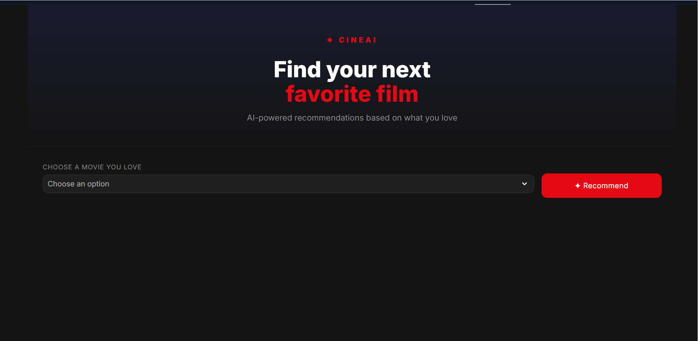
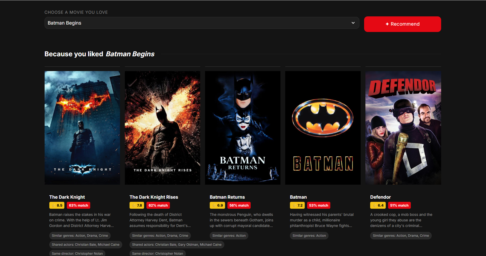

# 🎬 CineAI — AI-Powered Movie Recommender

A production-grade hybrid movie recommender system built from scratch using machine learning.

**Live Demo:** [huggingface.co/spaces/vaibhav343/movie-recommender](https://huggingface.co/spaces/vaibhav343/movie-recommender)

---




## How It Works

This system uses three models working together:

### 1. TF-IDF Content Model
Converts movie tags (genres, keywords, cast, director, overview) into vectors using Term Frequency-Inverse Document Frequency. Movies with rare, specific keywords in common score higher.

### 2. Word2Vec / GloVe Semantic Model
Uses pretrained GloVe vectors (trained on Wikipedia + news) to understand semantic meaning. Knows that "space" and "galaxy" are related even if they never appear together.

### 3. SVD Collaborative Filtering
Matrix factorization on 17.2 million real user ratings from MovieLens 25M. Discovers hidden taste patterns (latent factors) like "likes action", "prefers dark films" without anyone labeling them.

### Hybrid Ensemble
All three models are combined:
final_score = α × (TF-IDF + GloVe ensemble) + (1-α) × SVD

### Explainability
Every recommendation explains why:
- Similar genres
- Shared actors
- Same director
- Similar themes

---

## Dataset

| Source | Size |
|--------|------|
| MovieLens 25M | 25 million ratings, 62,000 movies |
| TMDB 5000 | 4,803 movies with metadata |
| Final merged | 4,602 movies, 17.2M ratings |

---

## Tech Stack

| Component | Technology |
|-----------|------------|
| Data processing | Pandas, NumPy |
| NLP | NLTK, scikit-learn (TF-IDF) |
| Word embeddings | Gensim (GloVe) |
| Collaborative filtering | Surprise (SVD) |
| Web app | Streamlit |
| Model storage | Hugging Face Hub |
| Deployment | Hugging Face Spaces (Docker) |

---

## Project Structure
```
movie-recommender-system/
├── src/
│   ├── data_pipeline.py       # data cleaning and feature engineering
│   ├── content_model.py       # TF-IDF + GloVe ensemble
│   ├── collaborative_model.py # SVD matrix factorization
│   ├── hybrid_model.py        # weighted blend
│   └── explainer.py           # recommendation explanations
├── data/
│   └── raw/                   # links.csv for TMDB ID mapping
├── models/                    # pkl files (loaded from HF Hub)
├── app.py                     # Streamlit web app
├── Dockerfile
└── requirements.txt
```
---

## Model Performance

- **SVD RMSE:** 0.78 on held-out test set (vs ~1.5+ for random guessing)
- **Dataset:** 17.2M ratings, 80/20 train/test split

---

## Local Setup

```bash
git clone https://github.com/vaibhav3792/movie-recommender-system.git
cd movie-recommender-system
python -m venv venv
venv\Scripts\activate
pip install -r requirements.txt
streamlit run app.py
```

> Note: Large model files are stored on Hugging Face Hub and downloaded automatically on first run.

---